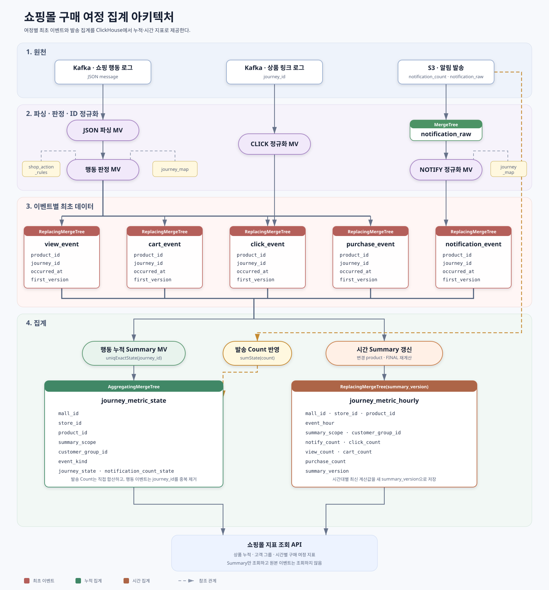

# A7 · a7-event-replacing_summary-count

[전체 비교](../README.md) · [공통 기준](../common/README.md) · [기대 기준](../../expected/README.md) · [아키텍처](../../docs/architecture.md#이벤트별-최초-데이터와-clickhouse-summary-개선안)

| 구분 | 경로 |
|---|---|
| 전체 누적 | 이벤트별 ReplacingMergeTree → exact-state summary → count |
| 시간·고객 그룹별 | 이벤트별 `FINAL` 재계산 → versioned summary → count |
| 발송 누적 | S3 `notification_count` → 누적 summary 직접 합산 |
| 생성 흐름 | 이벤트 종류별 최초 데이터 → 누적·시간 summary |
| 필요한 저장 대상 | 이벤트별 최초 테이블, 누적 summary, 시간 summary |
| 계획된 독립 DB | `shop_a7` |
| 현재 상태 | 설계 단계, DDL·실행 결과 없음 |

## 설계 목적

A7은 하나의 넓은 dedup aggregate state를 조회할 때 발생한 `argMinMerge` 비용을 줄이기 위한 후보입니다. VIEW·CART·CLICK·PURCHASE·NOTIFY를 이벤트별 테이블로 나누고, 서비스 조회는 작은 summary에서 처리합니다.



```text
행동·클릭 입력
  ├─ view_event
  ├─ cart_event
  ├─ click_event
  └─ purchase_event
          │  ReplacingMergeTree: 상품·여정별 가장 빠른 이벤트
          ├─ 누적 exact-state summary
          └─ 변경 상품 FINAL 재계산 → 시간·고객 그룹 summary

S3 발송 입력
  ├─ notification_count ─────────────→ 누적 summary 직접 합산
  └─ notification_raw → notification_event → 시간·고객 그룹 summary
```

## 최초 이벤트 기준

A1~A6의 현재 기준은 `(journey_id, event_kind)`별 최소 `received_at`입니다. A7은 실제 발생 시각을 기준으로 귀속하기 위해 최소 `occurred_at`을 사용합니다. 동일 시각은 `received_at`, `message_id` 순서로 결정하는 방안을 검증합니다.

따라서 standalone 샘플에서 A1~A6의 대표 CLICK은 `demo-02`지만 A7의 대표 CLICK은 발생 시각이 더 빠른 `demo-03`입니다. 누적 count는 같지만 CLICK의 시간 귀속은 10시에서 9시로 이동합니다. A7의 정확성과 성능은 이 정책 차이를 반영한 전용 기대값으로 판정해야 합니다.

`ReplacingMergeTree`의 version은 **더 빠른 `occurred_at`일수록 더 큰 값**이 되도록 변환해야 합니다. 구체적인 UInt64 변환과 동일 시각 tie-break 표현은 DDL 구현 전에 경계값·재입력 테스트로 확정합니다.

## 테이블 역할

| 대상 | 엔진 후보 | 키·상태 | 역할 |
|---|---|---|---|
| 이벤트별 최초 테이블 | ReplicatedReplacingMergeTree | `(product_id, journey_id)`, `first_version` | 이벤트 종류별 최초 후보 보관 |
| 누적 행동 지표 | ReplicatedAggregatingMergeTree | 상품·고객 그룹별 `uniqExactState(journey_id)` | 중복 없는 누적 exact count |
| 누적 발송 지표 | ReplicatedAggregatingMergeTree | 상품별 `sumState(notification_count)` | S3에서 받은 발송 count 합산 |
| 시간 지표 | ReplicatedReplacingMergeTree | 상품·시간·그룹, `summary_version` | 재계산 결과로 기존 시간 bucket 교체 |

최종 누적 summary의 조회 열은 `mall_id`, `store_id`, `product_id`, 고객 그룹과 각 이벤트 count입니다. `journey_id`는 결과 열이나 summary 정렬 키에 넣지 않고 aggregate state 내부의 중복 제거 값으로만 사용합니다.

## 반드시 분리할 발송 경로

- S3의 `notification_count`는 이미 집계된 수치이므로 여정 단위 unique 계산 없이 누적 summary에 직접 더합니다.
- `notification_raw`는 최초 발생 시각과 고객 그룹 귀속이 필요한 상세 지표에 사용합니다.
- 동일 발송을 두 경로에서 누적 summary에 함께 더하면 이중 집계되므로 입력 계약으로 경로를 구분합니다.
- 같은 S3 파일이나 집계 batch가 재처리될 때 `notification_count`가 다시 더해지지 않도록 batch ID 기반 멱등 처리 또는 version 교체 규칙이 필요합니다.

## 실시간성과 보정

일반 MV는 새 INSERT 블록만 처리하며 `ReplacingMergeTree`의 나중 merge 또는 `FINAL` 결과 변화를 다시 전달하지 않습니다. 그러므로 이벤트 테이블에 중복 후보가 들어올 때마다 단순 count MV로 시간 summary를 증가시키면 정확하지 않습니다.

누적 `uniqExactState`는 같은 `(product_id, journey_id)`의 중복을 상태 병합으로 제거할 수 있습니다. 반면 늦게 도착한 더 빠른 이벤트가 최초 시간을 변경하면 기존 시간 bucket을 빼고 새 bucket을 더해야 합니다. A7은 변경된 상품 범위를 `FINAL`로 다시 계산하고, 더 높은 `summary_version`으로 시간 summary를 교체하는 ClickHouse 내부 보정 절차를 사용합니다.

이 보정이 완료되기 전에는 시간 지표가 잠시 이전 bucket을 가리킬 수 있습니다. 따라서 A7의 실시간 목표에는 INSERT 완료 시간, 누적 summary 반영 시간, 시간 summary 보정 완료 시간을 각각 포함해야 합니다.

## 구현·검증 순서

1. 이벤트별 local/Distributed ReplacingMergeTree와 version 규칙을 구현합니다.
2. 중복·순서 역전·동일 시각 입력에서 `FINAL` 대표 행을 검증합니다.
3. 누적 exact-state summary와 S3 발송 count 경로를 분리해 구현합니다.
4. 변경 상품 시간 summary 재계산과 `summary_version` 교체를 구현합니다.
5. 공통 데이터의 A7 전용 기대 결과를 검증합니다.
6. 1건 INSERT와 microbatch 입력의 처리량·반영 지연을 각각 측정합니다.
7. A2~A6과 저장 공간, INSERT 처리량, p50·p95·p99, 최대 메모리를 비교합니다.

ClickHouse에 1행씩 동기 INSERT하면 part 생성과 MV 실행 오버헤드가 커집니다. 실제 적재 시험은 `async_insert` 또는 소비자 microbatch를 사용하되, 응답 시점과 summary 반영 시점을 별도로 측정합니다.

## 합격 조건

- `(product_id, journey_id, event_kind)`별 최소 `occurred_at` 이벤트가 선택됩니다.
- 같은 입력을 재처리해도 누적 count가 증가하지 않습니다.
- 더 빠른 이벤트가 늦게 들어오면 누적 count는 유지되고 시간 bucket만 이동합니다.
- S3 발송 count와 raw 발송 이벤트가 이중 집계되지 않습니다.
- 보정 완료 후 누적·시간·고객 그룹 결과가 A7 전용 기대값과 일치합니다.
- 목표 동시성에서 INSERT 지연과 조회 p95·p99가 정한 SLA를 만족합니다.
