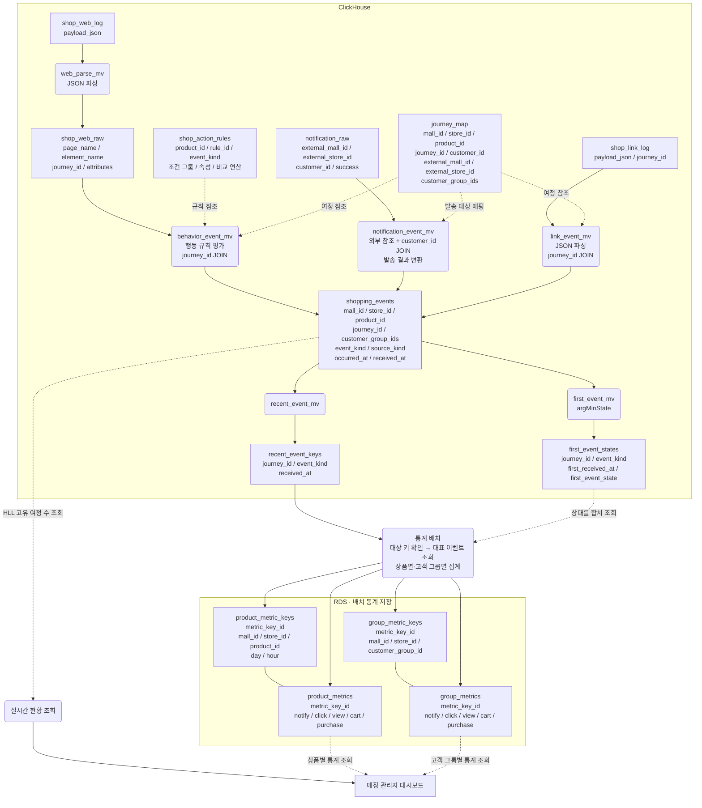
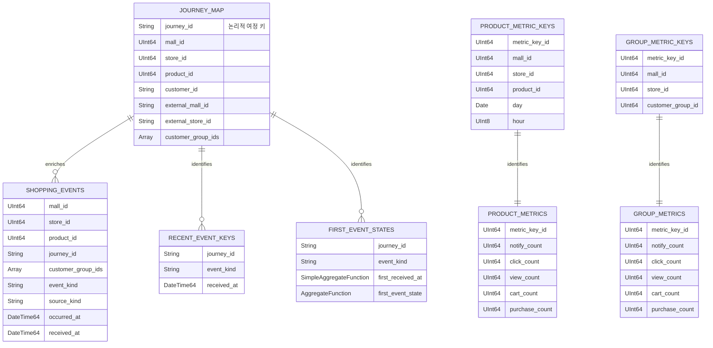

# 쇼핑몰 구매 여정 이벤트 분석 예제

`clickhouse-lab`의 [추가 예제](../README.md)입니다. 기존 `push-click-service`와 별도의 `shop_analytics` 데이터 모델을 사용합니다.

가상의 쇼핑몰에서 상품 안내 알림, 링크 클릭, 웹·앱 행동을 수집하여 전환 지표를 제공하는 학습용 모델입니다. 여러 입력을 ClickHouse에서 통합하고, 실시간 조회와 배치 통계 조회를 분리하는 구조를 표현합니다. 실행 가능한 DDL이나 현재 저장소의 배포 상태를 나타내지는 않습니다.

자료형과 엔진을 가정하여 작성한 [DDL 초안](./ddl-notes.md)은 별도 파일로 제공합니다. 실제 운영 정의를 추출한 자료가 아니며 구현 범위와 미확정 사항을 함께 확인해야 합니다.

## 예제의 도메인

```text
쇼핑몰
 └─ 입점 매장
     └─ 판매 상품
         └─ 고객별 구매 여정
             ├─ 상품 안내 알림 발송
             ├─ 알림 링크 클릭
             └─ 상품 조회 / 장바구니 담기 / 구매
```

| 식별자 | 의미 |
|---|---|
| `mall_id` | 쇼핑몰 |
| `store_id` | 입점 매장 |
| `product_id` | 매장별 판매 상품 |
| `customer_id` | 가상의 고객 |
| `journey_id` | 고객의 특정 상품에 대한 구매 여정 |
| `customer_group_ids` | 여정에 연결된 분석용 고객 그룹 목록 |

하나의 상품에는 여러 여정이 연결되고, 하나의 여정은 한 상품에 고정됩니다. 브라우저 세션 하나에서도 상품에 따라 여러 여정이 생길 수 있습니다.

이벤트 종류는 `NOTIFY`, `CLICK`, `VIEW`, `CART`, `PURCHASE`입니다. 같은 여정의 같은 이벤트가 반복되어도 고유 이벤트 통계에서는 한 번으로 취급합니다. 구매 지표도 고유 여정 수이며, 주문 건수나 매출과는 다릅니다.

## 이번 실험 범위

실행용 DDL은 아래 경로만 생성합니다. 상위 입력 파이프라인은 참고 구조이며 실험 준비에 필요하지 않습니다.

```text
정규화된 테스트 이벤트
    → shopping_events
        ├─ HLL / 최초 이벤트 직접 조회
        ├─ recent_event_keys
        └─ first_event_states → first_events → 시간·고객 그룹별 집계
```

shopping_events에는 상품·여정 매핑과 이벤트 판정이 완료된 데이터를 입력합니다.
이 문서 아래의 상위 테이블과 MV는 실행용 DDL에 포함되지 않습니다.
RDS 배치와 summary 갱신은 별도 케이스이며 아직 구현되지 않았습니다.

## 전체 참고 구조

사각형은 테이블, 둥근 노드는 MV 또는 처리 작업입니다. 실선은 처리 흐름이고 점선은 참조·조회 관계입니다.



고객 그룹별 키에는 이 예제에서 날짜·시간을 추가하지 않았습니다. 상품별 시간 통계와 고객 그룹별 통계는 별도 집계 단위로 표현합니다.

`recent_event_keys`는 배치가 확인할 키를 찾는 용도이며, 고유 이벤트의 정답 테이블이 아닙니다. 최근 키를 대상으로 하더라도 대표 이벤트는 `first_event_states`에 남은 전체 상태를 합쳐 선택해야 합니다. 구체적인 배치 처리 범위와 저장 방식은 별도 구현 사항입니다.

## 입력별 처리

| 입력 | 포함된 정보 | 처리 | 생성되는 이벤트 |
|---|---|---|---|
| 웹·앱 로그 | 화면, 요소, 속성, 여정 ID | JSON 파싱 → 상품별 규칙 평가 → 여정 정보 보강 | VIEW / CART / PURCHASE |
| 알림 발송 결과 | 외부 쇼핑몰·매장 참조, 고객, 성공 여부 | 여정 매핑 조회 → 성공 결과 변환 | NOTIFY |
| 링크 접속 로그 | 여정 ID를 포함한 접속 정보 | JSON 파싱 → 여정 정보 보강 | CLICK |

웹·앱 행동 규칙의 가상 예시는 다음과 같습니다.

| 조건 | 이벤트 |
|---|---|
| 상품 상세 화면 표시 | VIEW |
| 장바구니 추가 완료 | CART |
| 주문 완료 화면에서 구매 확인 | PURCHASE |

실제 주문 검증이나 매출 정산은 이 분석 모델의 범위에 포함하지 않습니다.

## 전체 참고 모델의 테이블

| 테이블 | 용도 |
|---|---|
| `shop_web_log` | 수집한 웹·앱 JSON 로그 |
| `shop_web_raw` | 화면·요소·여정 등을 추출한 로그 |
| `shop_action_rules` | 상품별 행동 판정 규칙 |
| `notification_raw` | 외부에서 받은 알림 발송 결과 |
| `shop_link_log` | 링크 접속 로그 |
| `journey_map` | 쇼핑몰·매장·상품·고객·여정 연결 |
| `shopping_events` | 세 입력 경로에서 모은 구매 여정 이벤트 |
| `recent_event_keys` | 배치에서 확인할 최근 키 |
| `first_event_states` | 여정·이벤트별 대표 이벤트 집계 상태 |

여정 매핑 조회의 결과가 여러 행이면 이벤트가 여러 개로 늘어날 수 있습니다. 외부 참조와 고객의 조합이 여정을 하나로 특정하는지, 여러 상품의 여정으로 전개하는지 예제 데이터를 만들 때 명시해야 합니다.

## 논리 ERD

아래는 주요 논리 키와 관계입니다. ClickHouse에 외래 키나 UNIQUE 제약을 선언한다는 뜻은 아닙니다. `first_event_states`의 한 키에 여러 물리 상태 행이 있을 수 있으므로, 한 행만 있다고 가정해서 조회하면 안 됩니다.



## 대표 이벤트와 집계의 의미

- 중복 판단 키는 `(journey_id, event_kind)`입니다.
- 이 구조 설명에서는 최초 수집 기준을 사용합니다. `first_received_at`은 최소 `received_at`, `first_event_state`는 그 수집 시각의 이벤트 속성 묶음을 담는 `argMin` 상태입니다.
- 실제 시간별 집계에 사용할 시각은 선택된 이벤트의 발생 시각인지 최초 수집 시각인지 별도로 정의해야 합니다. 두 시각은 같은 의미가 아닙니다.
- `shopping_events`의 HLL 조회는 상품·이벤트별 고유 여정 수를 근사 계산합니다. 최초 이벤트의 시간 귀속을 결정하지는 않습니다.
- 배치는 `argMinMerge`로 대표 이벤트를 구한 뒤 상품별·고객 그룹별로 카운트합니다. 그룹 배열에 같은 ID가 반복되면 중복을 제거한 뒤 펼칩니다. 한 여정이 여러 그룹에 속할 수 있으므로 그룹별 합계가 상품별 합계보다 클 수 있습니다.
- RDS 통계의 재시도에서는 같은 데이터를 다시 더하지 않도록 저장 방식을 설계해야 합니다. 이 그림은 저장 결과의 역할을 표현하며, 구체적인 갱신 알고리즘을 확정하지 않습니다.

`first_event_states`는 중복 입력을 차단하는 테이블이 아닙니다. 그 뒤에 증분 카운트 MV를 붙이는 것만으로 정확한 시간별 통계가 자동 유지되지는 않습니다.

이 문서는 기존 형태의 구조를 설명합니다. 최소 발생 시각 기준으로의 변경, RDS 제거, ClickHouse 내부 통계 테이블 도입은 별도의 개선안입니다. 샤딩·복제·TTL·배치 실행 주기와 실제 처리량은 포함하지 않습니다.
